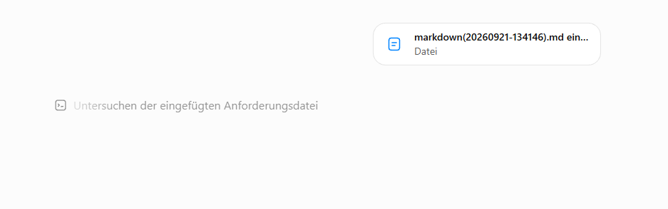
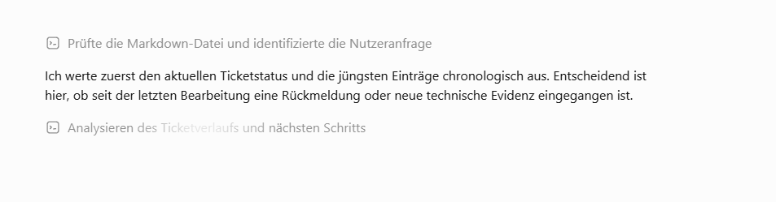
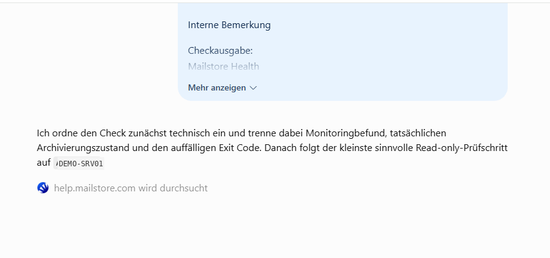
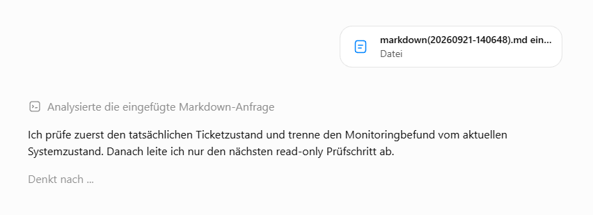
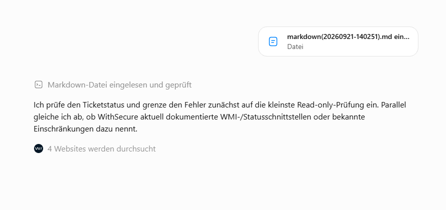
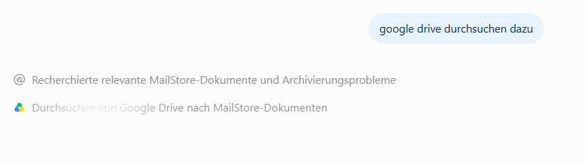
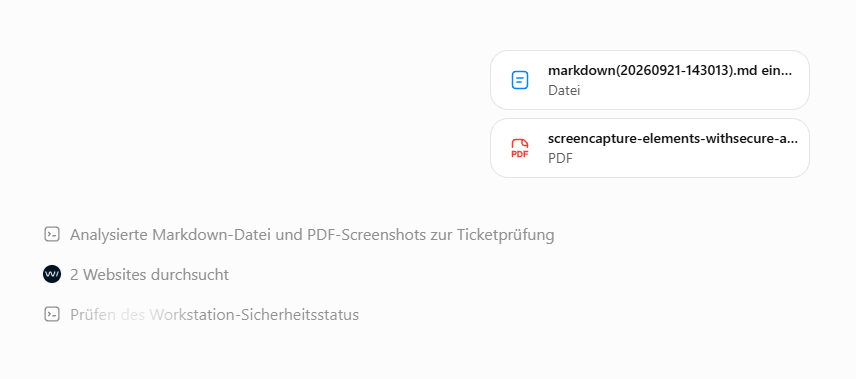

# IT Support Assistant

A private IT support workflow project designed to combine structured ticket analysis, existing troubleshooting history, internal knowledge and external technical research.

This private project explores how existing ticket information, previous troubleshooting steps, internal documentation and external technical sources can be combined into a structured workflow for IT fault analysis.

> **Portfolio repository:** This repository documents the concept and workflow. It does not contain production customer tickets, credentials, internal prompts or confidential infrastructure data.

## Motivation

Long-running IT support cases often contain information distributed across multiple messages, diagnostic outputs and previous troubleshooting attempts. This makes it harder to quickly determine what has already been tested, what changed, which information is still missing and what the next useful diagnostic step should be.

The IT Support Assistant is intended to structure this information and support the troubleshooting process without replacing the administrator's technical judgement.

## Workflow

```text
Support case / Markdown
          |
          v
Chronological ticket analysis
          |
          +----> Internal knowledge base (Google Drive)
          |
          +----> Vendor documentation
          |
          +----> Web research
          |
          v
Context correlation
          |
          v
Next diagnostic step
```

## Features

- **Ticket analysis** — evaluates the current support case chronologically and identifies the original issue, previous actions, feedback, diagnostic results and unresolved points.
- **Context-aware troubleshooting** — takes previous troubleshooting steps into account before proposing additional checks.
- **Internal knowledge search** — can include relevant information from a connected Google Drive knowledge base.
- **External research** — can research vendor documentation and other technical web sources when additional information is required.
- **Diagnostic guidance** — correlates the available information to determine an appropriate next verification or troubleshooting step.
- **Read-only-first approach** — where appropriate, narrows the investigation to a minimal non-invasive verification step before changes are considered.
- **Multiple evidence sources** — can evaluate a structured ticket together with supporting files such as PDF screenshots and correlate them with external research.

## Example workflow

### 1. Support case input

A prepared support case is supplied as a Markdown file. The assistant first examines the provided information before beginning the technical analysis.



### 2. Chronological ticket analysis

The assistant identifies the current request and evaluates recent ticket entries chronologically. The objective is to distinguish existing findings and completed troubleshooting from new technical evidence.



### 3. Technical classification and vendor research

Monitoring results are not automatically treated as the root cause. The workflow can separate monitoring status, actual service state and diagnostic output before selecting the next appropriate read-only verification step. Product-specific vendor documentation can be researched where necessary.

The hostname shown in this public screenshot has been replaced with a synthetic demo hostname.



### 4. Monitoring finding vs. actual system state

The workflow explicitly separates a monitoring finding from the current system state. Before proposing changes, it derives only the next useful read-only verification step.

This keeps the investigation evidence-based and reduces unnecessary intervention while the actual ticket status is still being established.



### 5. Parallel vendor research

Where product-specific information is required, the assistant can research current vendor documentation in parallel with the ticket analysis. In this example, it checks WithSecure documentation for WMI/status interfaces and known limitations.



### 6. Internal knowledge-base research

The workflow can additionally search an internal Google Drive knowledge base for existing technical documentation, notes and information from comparable cases.



### 7. Ticket analysis with supporting evidence

A support case can also be evaluated together with additional evidence. In this example, the assistant analyzes the Markdown ticket and attached PDF screenshots, researches relevant web sources and then continues with the workstation security-status check.

This demonstrates that the workflow is not limited to plain ticket text and can incorporate supporting material into the troubleshooting context.



## Example input

A synthetic example ticket is included in [`examples/example-ticket.md`](examples/example-ticket.md). It demonstrates the type of structured input that can be supplied without exposing real customer information.

## Privacy and security

IT support data may contain personal, customer-specific or infrastructure-related information. Public demonstrations therefore use synthetic or anonymized data.

This repository intentionally contains no:

- customer tickets or personal data
- passwords, API keys or access tokens
- real internal hostnames, domains or IP addresses
- confidential infrastructure documentation
- production prompts or private knowledge-base content

## Project status

**Active private project / portfolio documentation.**

The workflow is being refined using practical IT troubleshooting scenarios. A future public example may demonstrate the complete path from ticket input through analysis and research to the final diagnostic recommendation.

## Scope

This repository is intended to document the project and its design. It is not currently published as a standalone production application or a replacement for established ticketing, monitoring or knowledge-management systems.
